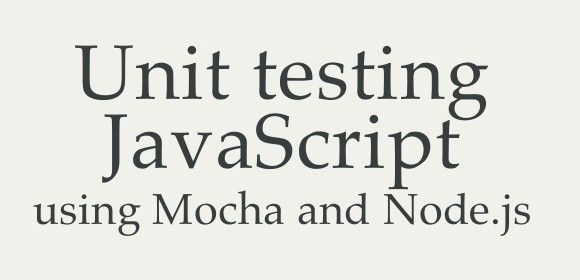

# Unit testing JavaScript (mocha + node.js) 

Testando as coisas em JavaScript no servidor (Node.js).

Dependências

    npm install -g mocha
    npm install should --save-dev

Instalando...

    npm install

Exemplo tdd

    suite('Foo,', function () {
    suite('bar()', function () {
        test('foo bar', function () {
        assert.equal("foobar", foo.bar());
        });
    });
    });

    ./node_modules/mocha/bin/mocha  --ui tdd

Exemplo bdd...

